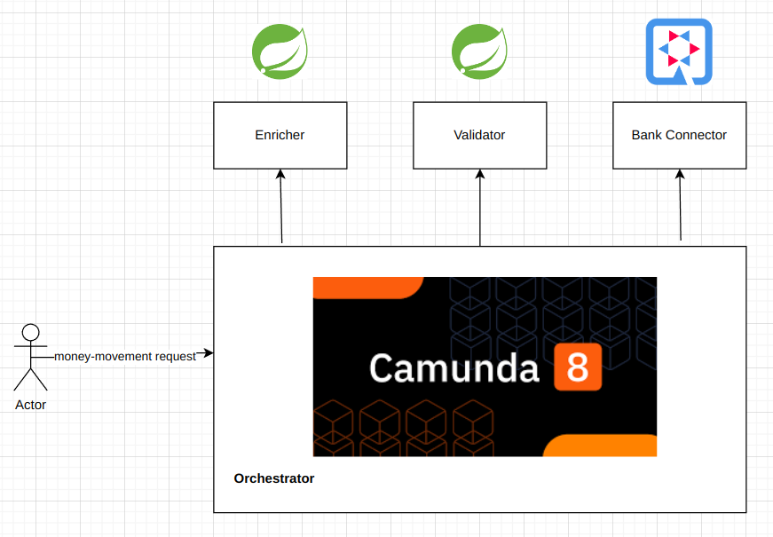
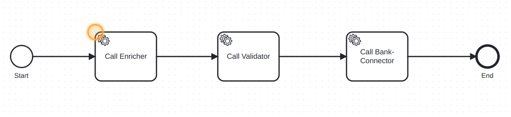

# money-transfer-camunda8

This is a example project showcasing multiple polyglot JVM microservice orchestration powered by Camunda

# L1 Diagram

# Process Model

# How to run
1. Clone the project and run each apps separately
2. Go to Camunda cloud and import your bpmn
3. Specify the correct camunda cloud credentials in your application properties for each module / microservice
4. Deploy and Run your process
5. Notice the flow goes from `enricher` -> `validator` -> `bank-connector`

